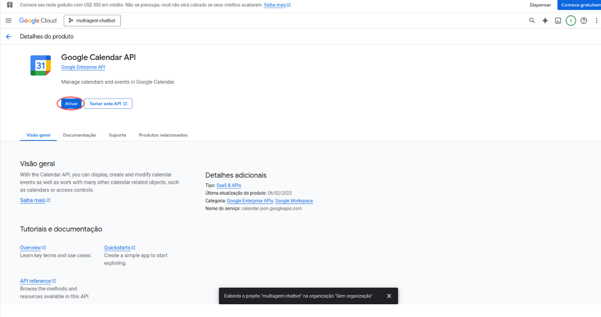

# Multi-Agent Chatbot

A multi-agent chatbot system that integrates calendar functionality, web search, and knowledge base using OpenAI API. The system is fully internationalized in English.

## Features

- **Multi-Agent System**: Different specialized agents for specific tasks
- **Google Calendar Integration**: Create, edit, view, and delete events
- **Web Search**: Real-time Tavily integration
- **Knowledge Base**: RAG system with pgvector for document queries
- **Web Interface**: Intuitive English Streamlit interface
- **REST API**: FastAPI for integration with other systems
- **Permission System**: Granular calendar access control
- **Authentication**: User login and registration system
- **Vector Database**: pgvector integration for enhanced RAG capabilities

## 🎥 Demo

### 📹 **Watch It Work**

> **[🎬 View Demo Video](docs/videos/app-demo.mp4)**

See the Multi-Agent Chatbot in action - from calendar scheduling to web searches and document queries.

---

### 🖼️ **Screenshots**

| Login Interface | Chat Interface |
|:---:|:---:|
|  |  |
| *Login panel interface* | *Natural conversation interface* |

---

### 💬 **Example Conversations**

**Calendar Management:**
```
User: "Schedule a team meeting tomorrow at 2pm"
Assistant: ✅ Meeting scheduled for tomorrow 2:00-3:00 PM
📧 Calendar invite sent to team members
```

**Web Search:**
```
User: "What's the latest news about AI?"
Assistant: 🔍 Found recent AI developments:
• OpenAI releases GPT-4 Turbo
• Google announces Gemini updates
• Meta launches new AI research...
```

**Document Search:**
```
User: "What does our policy say about remote work?"
Assistant: 📄 Based on your HR documents:
• Remote work allowed 3 days/week
• Core hours: 10 AM - 2 PM overlap required
• Equipment allowance: $500/year
```

## Project Structure

```
multiagent-chatbot/
├── src/                          # Main source code
│   ├── agents/                   # Agents and prompts
│   │   ├── prompts/             # Agent prompts (English)
│   │   └── agents_main.py       # Main agent logic
│   ├── api/                     # FastAPI
│   │   ├── api.py              # API endpoints
│   │   └── db_functions.py     # Database functions
│   ├── tools/                   # Agent tools
│   │   ├── calendar_tools.py   # Calendar tools
│   │   └── rag_tool.py         # RAG search tool
│   └── web/                     # Web interface
│       └── app.py              # Streamlit application (English)
├── config/                      # Configuration files
│   ├── .env                    # Environment variables
│   ├── .env.example           # Environment variables template
│   ├── credentials.json       # Google credentials
│   └── credentials.example.json
├── auth/                        # Authentication files
│   ├── token.json             # Main Google token
│   └── tokens/                # User-specific tokens
├── database/                    # Database files
│   ├── usuarios.sqlite        # User database
│   └── tmp/                   # Agent temporary data
├── data/                        # Documents for RAG
├── docs/                        # Documentation
├── run_api.py                   # Script to run the API
├── run_web.py                   # Script to run the web interface (English)
└── requirements.txt             # Python dependencies
```

## Prerequisites

- Python 3.8+
- Docker (for pgvector database)
- Google account with Google Calendar API access
- OpenAI API key
- Tavily API key (optional, for web search)
- HuggingFace token (optional, for RAG)

## Installation

### 1. Clone the repository:
```bash
git clone https://github.com/tomlavez/multiagent-chatbot.git
cd multiagent-chatbot
```

### 2. Create a virtual environment:
```bash
python -m venv .venv
source .venv/bin/activate  # Linux/Mac
# or
.venv\Scripts\activate  # Windows
```

### 3. Install dependencies:
```bash
pip install -r requirements.txt
```

### 4. Set up pgvector database:

Start the PostgreSQL database with pgvector extension using Docker:

```bash
docker run -d \
  -e POSTGRES_DB=ai \
  -e POSTGRES_USER=ai \
  -e POSTGRES_PASSWORD=ai \
  -e PGDATA=/var/lib/postgresql/data/pgdata \
  -v pgvolume:/var/lib/postgresql/data \
  -p 5532:5432 \
  --name pgvector \
  agnohq/pgvector:16
```

This command will:
- Create a PostgreSQL database with pgvector extension
- Set up database credentials (db: ai, user: ai, password: ai)
- Expose the database on port 5532
- Create a persistent volume for data storage

### 5. Configure environment variables:
```bash
cp config/.env.example config/.env
```

Edit the `config/.env` file with your API keys:
```env
OPENAI_API_KEY=your_openai_key_here
TAVILY_API_KEY=your_tavily_key_here
HUGGINGFACEHUB_API_TOKEN=your_huggingface_token_here

# pgvector Database Configuration
PGVECTOR_HOST=localhost
PGVECTOR_PORT=5532
PGVECTOR_DB=ai
PGVECTOR_USER=ai
PGVECTOR_PASSWORD=ai
```

## 🔧 Google Cloud Platform (GCP) Setup Guide

This section provides a comprehensive step-by-step guide to configure Google Cloud Platform and obtain the necessary credentials for Google Calendar integration.

### 📋 What You'll Need

- A Google account
- Access to Google Cloud Console
- Admin privileges to create projects and enable APIs

### 🎯 Overview

The setup process involves:
1. Creating or selecting a GCP project
2. Enabling the Google Calendar API
3. Setting up OAuth 2.0 credentials
4. Configuring consent screen
5. Downloading and installing credentials

---

### Step 1: Access Google Cloud Console

1. **Open Google Cloud Console**
   - Navigate to [https://console.cloud.google.com/](https://console.cloud.google.com/)
   - Sign in with your Google account

2. **Accept Terms of Service** (if first time)
   - Read and accept Google Cloud Terms of Service
   - Complete any required verification steps

---

### Step 2: Create or Select a Project

#### Option A: Create a New Project

1. **Click the project selector** in the top navigation bar
   
   

2. **Click "NEW PROJECT"**
   
   

3. **Fill in project details:**
   - **Project name**: `multiagent-chatbot` (or your preferred name)
   - **Organization**: Select your organization (optional)
   - **Location**: Choose your preferred location
   
   

4. **Click "CREATE"**
   - Wait for the project to be created (usually takes 30-60 seconds)

#### Option B: Select an Existing Project

1. **Click the project selector** in the top navigation
2. **Choose your existing project** from the list
   
   

---

### Step 3: Enable Google Calendar API

1. **Navigate to APIs & Services**
   - In the left sidebar, click **"APIs & Services"** → **"Library"**
   
   

2. **Search for Google Calendar API**
   - In the search bar, type: `Google Calendar API`
   - Click on **"Google Calendar API"** from the results
   
   

3. **Enable the API**
   - Click the **"ENABLE"** button
   - Wait for the API to be enabled (usually instant)
   
   

4. **Verify API is enabled**
   - You should see a green checkmark and "API enabled" message
   
   

---

### Step 4: Configure OAuth Consent Screen

1. **Go to OAuth consent screen**
   - Navigate to **"APIs & Services"** → **"OAuth consent screen"**
   
   

2. **Create a new Project**

   

3. **Fill in App Information**
   - **App name**: `Multi-Agent Chatbot`
   - **User support email**: Your email address
   - **User type**: Select **"External"** (recommended for most users)
   - **App logo**: Upload a logo (optional)
   - **App domain**: Leave blank for testing
   - **Developer contact information**: Your email address
   
   

4. **Configure Scopes (Next page)**
   - Click **"ADD OR REMOVE SCOPES"**
   - Search for and select:
     - `https://www.googleapis.com/auth/calendar`
     - `https://www.googleapis.com/auth/calendar.events`
   
   

5. **Add Test Users** (for external apps)
   - Click **"ADD USERS"**
   - Add your email address and any other test users
   
   

---

### Step 5: Create OAuth 2.0 Credentials

1. **Navigate to Credentials**
   - Go to **"APIs & Services"** → **"Credentials"**
   
   

2. **Create New Credentials**
   - Click **"+ CREATE CREDENTIALS"**
   - Select **"OAuth client ID"**
   
   

3. **Configure OAuth Client**
   - **Application type**: Select **"Desktop application"**
   - **Name**: `multiagent-chatbot-desktop`
   
   

4. **Create the Client**
   - Click **"CREATE"**
   - A popup will show your client ID and secret

   

---

### Step 6: Download Credentials

1. **Download JSON File**
   - In the credentials popup, click **"DOWNLOAD JSON"**
   - Or click the download icon next to your created credential
   
   

2. **Save the File**
   - Save the downloaded file as `credentials.json`
   - Move it to the `config/` directory of your project:
   
---

### Step 7: Verify Setup

1. **Check File Structure**
   ```
   multiagent-chatbot/
   ├── config/
   │   ├── credentials.json  ← Your downloaded file should be here
   │   └── .env
   ```

2. **Verify Credentials Format**
   The `credentials.json` file should look like this:
   ```json
   {
     "installed": {
       "client_id": "your-client-id.googleusercontent.com",
       "project_id": "your-project-id",
       "auth_uri": "https://accounts.google.com/o/oauth2/auth",
       "token_uri": "https://oauth2.googleapis.com/token",
       "auth_provider_x509_cert_url": "https://www.googleapis.com/oauth2/v1/certs",
       "client_secret": "your-client-secret",
       "redirect_uris": ["http://localhost"]
     }
   }
   ```

---

### 🔐 Security Best Practices

1. **Keep credentials secure**
   - Never commit `credentials.json` to version control
   - The file is already in `.gitignore`

2. **Use environment-specific credentials**
   - Use different projects for development and production
   - Rotate credentials periodically

3. **Monitor API usage**
   - Check the GCP console for API quotas and usage
   - Set up billing alerts if needed

---

### 🚨 Troubleshooting

#### Common Issues and Solutions

1. **"Access blocked" error during OAuth**
   - **Solution**: Ensure your app is in "Testing" mode in OAuth consent screen
   - Add your email to test users list

2. **"API not enabled" error**
   - **Solution**: Verify Google Calendar API is enabled in your project
   - Check you're using the correct project

3. **"Invalid credentials" error**
   - **Solution**: Re-download credentials.json from GCP console
   - Ensure file is in `config/` directory with correct name

4. **"Quota exceeded" error**
   - **Solution**: Check API quotas in GCP console
   - Implement rate limiting in your application

#### Getting Help

- **GCP Documentation**: [Google Calendar API Documentation](https://developers.google.com/calendar/api)
- **OAuth 2.0 Guide**: [Google OAuth 2.0 Documentation](https://developers.google.com/identity/protocols/oauth2)
- **Project Issues**: [GitHub Issues](https://github.com/tomlavez/multiagent-chatbot/issues)

---

### ✅ Next Steps

Once you've completed the GCP setup:

1. Continue with the installation process
2. Run the application and complete OAuth flow
3. Test calendar integration functionality

The first time you run the application, it will open a browser window for OAuth authorization. Follow the prompts to grant calendar access permissions.

---

## Usage

### Run the API (FastAPI)

```bash
python run_api.py
```

The API will be available at `http://localhost:8000`

### Run the Web Interface (Streamlit)

```bash
python run_web.py
```

The web interface will be available at `http://localhost:8501`

**Note**: The web interface is fully available in English, including:
- Login and registration forms
- Calendar permission settings
- Chat interface
- Status messages and notifications

### Using the API directly

1. **User registration:**
```bash
curl -X POST "http://localhost:8000/register" \
     -H "Content-Type: application/json" \
     -d '{"username": "user", "password": "password", "email": "email@example.com"}'
```

2. **Login:**
```bash
curl -X POST "http://localhost:8000/login" \
     -H "Content-Type: application/json" \
     -d '{"username": "user", "password": "password", "calendar_permissions": "full_access"}'
```

3. **Chat:**
```bash
curl -X POST "http://localhost:8000/chat" \
     -H "Content-Type: application/json" \
     -H "token: YOUR_TOKEN_HERE" \
     -d '{"message": "Create an event for tomorrow at 2pm", "username": "user"}'
```

## Calendar Permission Levels

- **readonly**: View events only
- **read_update**: View and edit existing events
- **full_access**: Full control (create, edit, delete events)

## Available Agents

All agent prompts are configured in English for consistent international usage:

1. **Identifier Agent**: Classifies the type of user request
2. **Helper Agent**: Answers general questions and performs searches
3. **Calendar Agent**: Manages Google Calendar events
4. **Auxiliary Agent**: Searches user information
5. **Verifier Agent**: Validates and reviews responses

## Integrated Tools

- **Google Calendar**: Complete event management
- **Tavily Search**: Real-time web search
- **RAG System**: Local knowledge base queries with pgvector
- **Time System**: Date and time manipulation tools
- **Vector Database**: Enhanced document search capabilities

## Development

To contribute to the project:

1. Fork the repository
2. Create a feature branch (`git checkout -b feature/new-feature`)
3. Commit your changes (`git commit -am 'Add new feature'`)
4. Push to the branch (`git push origin feature/new-feature`)
5. Open a Pull Request

## License

This project is licensed under the MIT License - see the LICENSE file for details.
